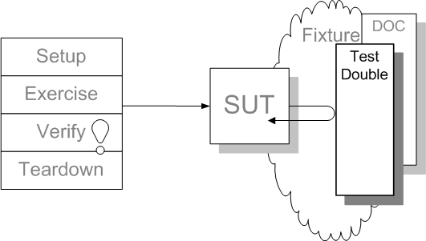

---
# try also 'default' to start simple
theme: seriph
# random image from a curated Unsplash collection by Anthony
# like them? see https://unsplash.com/collections/94734566/slidev
background: https://source.unsplash.com/collection/94734566/1920x1080
# apply any windi css classes to the current slide
class: 'text-center'
# https://sli.dev/custom/highlighters.html
highlighter: shiki
# show line numbers in code blocks
lineNumbers: false
# some information about the slides, markdown enabled
info: |
  ## Testing Terraform Code
  Tools & Strategies
# persist drawings in exports and build
drawings:
  persist: false
# use UnoCSS
css: unocss
---

# Testing Terraform Code

Tools & Strategies

<div class="abs-br m-6 flex gap-2">
  <a href="https://github.com/burakince/testing-terraform-presentation" target="_blank" alt="GitHub"
    class="text-xl icon-btn opacity-50 !border-none !hover:text-white">
    <carbon-logo-github />
  </a>
</div>

---

# What is a test?



<small>Reference: http://xunitpatterns.com/Test%20Double.html</small>

---

# What is Infrastructure as Code (IaC)?


<small>Reference: https://developer.hashicorp.com/terraform/tutorials/aws-get-started/infrastructure-as-code</small>

---

# IaC Testing Strategies?

We have two main categories for the IaC tests.

- Test Executers
- Target System

## Test Executers

We can separate test executers to again two main categories.

- Logical infrastructure code/script validators.
- Explicit testers to target system.

## Target systems

- Real system (Cloud provider or bare metal system)
- Emulator system (e.g. [LocalStack](https://localstack.cloud/))

---

# Logical Validators

These validators check for syntax errors or logical violations. Some of them doing this from <kbd>terraform plan</kbd> operation.

- [Tflint](https://github.com/terraform-linters/tflint)
- [Tfsec](https://github.com/aquasecurity/tfsec)
- [Terrascan](https://runterrascan.io/)
- [Checkov](https://www.checkov.io/)
- [Terraform Compliance](https://terraform-compliance.com/)
- [Conftest](https://www.conftest.dev/)

---

# Logical Validator - Tflint

A Pluggable Terraform Linter


<small>Reference: https://cloudskiff.com/terraform-code-quality/</small>

---

# Logical Validator - Tfsec

tfsec uses static analysis of your terraform code to spot potential misconfigurations.


---

# Logical Validator - Terrascan

Terrascan is a static code analyzer for Infrastructure as Code.


---

# Logical Validator - Checkov

Checkov is a static code analysis tool for infrastructure as code (IaC) and also a software composition analysis (SCA) tool for images and open source packages.


---

# Logical Validator - Terraform Compliance

terraform-compliance is a lightweight, security and compliance focused test framework against terraform to enable negative testing capability for your infrastructure-as-code.


---

# Logical Validator - Conftest

Conftest helps you write tests against structured configuration data.

---

# Logical Validator - Conftest 1

[terraform.tf](https://github.com/open-policy-agent/conftest/blob/master/examples/hcl2/terraform.tf)

```hcl
resource "aws_security_group_rule" "my-rule" {
  type        = "ingress"
  cidr_blocks = ["0.0.0.0/0"]
}

resource "aws_alb_listener" "my-alb-listener" {
  port     = "80"
  protocol = "HTTP"
}

resource "aws_db_security_group" "my-group" {

}

resource "azurerm_managed_disk" "source" {
  encryption_settings {
    enabled = false
  }
}
```

---

# Logical Validator - Conftest 2

[policy/deny.rego](https://github.com/open-policy-agent/conftest/blob/master/examples/hcl2/policy/deny.rego)

```go
package main

has_field(obj, field) {
	obj[field]
}

deny[msg] {
	proto := input.resource.aws_alb_listener[lb].protocol
	proto == "HTTP"
	msg = sprintf("ALB `%v` is using HTTP rather than HTTPS", [lb])
}

deny[msg] {
	rule := input.resource.aws_security_group_rule[name]
	rule.type == "ingress"
	contains(rule.cidr_blocks[_], "0.0.0.0/0")
	msg = sprintf("ASG `%v` defines a fully open ingress", [name])
}

deny[msg] {
	disk = input.resource.azurerm_managed_disk[name]
	has_field(disk, "encryption_settings")
	disk.encryption_settings.enabled != true
	msg = sprintf("Azure disk `%v` is not encrypted", [name])
}
```

---

# Logical Validator - Conftest 3

[policy/deny_test.rego](https://github.com/open-policy-agent/conftest/blob/master/examples/hcl2/policy/deny_test.rego)

```go
package main

empty(value) {
	count(value) == 0
}

no_violations {
	empty(deny)
}

test_blank_input {
	no_violations with input as {}
}

test_correctly_encrypted_azure_disk {
	no_violations with input as {"resource": {"azurerm_managed_disk": {"sample": {"encryption_settings": {"enabled": true}}}}}
}

test_fails_with_http_alb {
	cfg := parse_config("hcl2", `
		resource "aws_alb_listener" "name" {
			protocol = "HTTP"
		}
	`)
	deny["ALB `name` is using HTTP rather than HTTPS"] with input as cfg
}
```

---

# Explicit Testers

These testers run IaC to the target system with the test parameters and compare the actual system states with the expected ones.

- [Terratest](https://terratest.gruntwork.io/)
- [Kitchen-Terraform](https://github.com/newcontext-oss/kitchen-terraform)

---

# Explicit Testers - Terratest

Terratest is a Go library developed by Gruntwork that helps you create and automate tests for your IaC written with Terraform, Packer for IaaS providers like Azure, Amazon, Google, or for a Kubernetes cluster. [Terraform Azure Example](https://github.com/gruntwork-io/terratest/tree/master/examples/azure/terraform-azure-example)

[terraform_azure_example_test.go](https://github.com/gruntwork-io/terratest/blob/master/test/azure/terraform_azure_example_test.go)

```go {all|1|2|4-6|8|10|12-13|15-17|all}
func TestTerraformAzureExample(t *testing.T) {
	t.Parallel()

	terraformOptions := &terraform.Options{
		TerraformDir: "../../examples/azure/terraform-azure-example",
	}

	defer terraform.Destroy(t, terraformOptions)

	terraform.InitAndApply(t, terraformOptions)

	vmName := terraform.Output(t, terraformOptions, "vm_name")
	resourceGroupName := terraform.Output(t, terraformOptions, "resource_group_name")

	actualVMSize := azure.GetSizeOfVirtualMachine(t, vmName, resourceGroupName, "")
	expectedVMSize := compute.VirtualMachineSizeTypes("Standard_B1s")
	assert.Equal(t, expectedVMSize, actualVMSize)
}
```

---

# Explicit Testers - Kitchen Terraform

Kitchen-Terraform provides a set of [Kitchen](https://kitchen.ci/index.html) plugins which enable the use of Kitchen to converge a Terraform configuration and verify the resulting infrastructure systems with InSpec controls.

## What is Test Kitchen?

Test Kitchen provides a test harness to execute infrastructure code on one or more platforms in isolation.

---
layout: center
class: text-center
---

# Thanks

[GitHub](https://github.com/burakince) · [Website](https://burakince.net)
